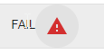

Document Pre-Check [external page.](../static/img/TroubleshootingFailedFileUploads.pdf)
Skip to Accessing Data [Accessing your Data.](doc3.md)  

You've gained access to the global group and have successfully logged into the Data Lake, now what? 
Lets now walk through the steps needed to drop a file into the Data Lake using Content Explorer. 

### Overview

export const Highlight = ({children, color}) => (
  
    {children}
  
);

<h4>Creating New Data set</h4>

- Access Content Explorer 
- Create Folder at root level
- Within folder create a new folder that will be converted to a data set
- Navigate to Base Config Tab at the top of the screen
- Toggle the Dataset radio button to on and it will change the color to <Highlight color="#1877F2">blue</Highlight>
- Press Save button in lower left section of the screen to save data set

<h4>Loading a file</h4>

 - Within the data set navigate to the Files tab
 - Click the Upload File button for the file upload screen to appear
 - Drop file(s) into the "Drop Files here" area or Select a file from your computer by clicking the "Select Files"
   button in the upper left corner 
 - Press Done once all files have been loaded
 - Your file(s) will be listed along with the status of the process 

:::note
If you recieve a status other than **COMPLETE**, check the troubleshooting section for more information on how to fix the error.
:::
### Video Link
If you are a visual learner, I have included a video that outlines these steps below. 

<figure class="video_container">
  <video width="420" height="340" controls="true" allowfullscreen="true" poster="/img/videoPlayPoster.png">
    <source src="/img/howTo.mp4" type="video/mp4"/>
  </video>
</figure>

<!-- this works
 -->

### Troubleshooting
:::caution
Recieve an error?
:::

Don't worry, we have seen this before so we documented some of the common issues that may cause a file to fail. Take a look at this guide for quick tips. 

| Error                      |       Description                                | Possible Fix                 |
|:---                        |          :---:                                   |                        ---:  |
| Failed                     |       File failed to upload                      |  [Failed Files Troubleshooting](../static/img/TroubleshootingFailedFileUploads.pdf)             |
| Extraneous Input           | File fails to load. This error name is displayed if you hover over error           |  [Extraneous Input TS](../static/img/extraneousInputError.pdf)                             |
| Mismatch Input             | File fails to load. This error name is displayed if you hover over error |   [Mismatch Input TS](../static/img/mismatchError.pdf)                           |
| Boxed Error                |The uploaded files do not match a single column column with the previous schema   |  Link to box error           |
                               

