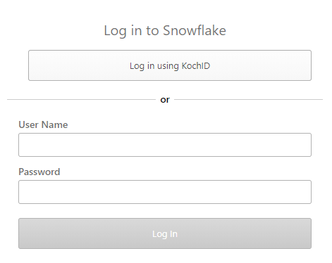
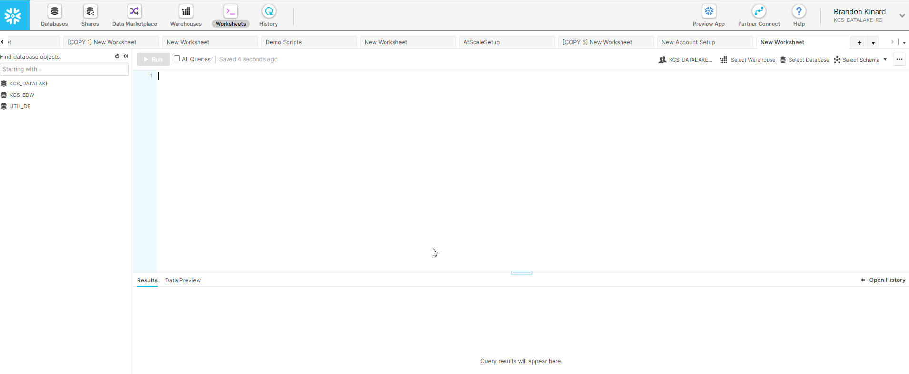
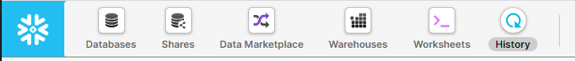

## Snowflake

### Console Access 

1. Logon to the Snowflake UI environment of your choosing using the links below:
    - Production - https://kcsitsf1.us-east-1.snowflakecomputing.com/console  
    - Development - https://kcsitsf2.us-east-1.snowflakecomputing.com/console 

2. Upon first logon you will see a screen similar to this:

The first time you sign in you will be required to use your User Name and password rather the KochID.
- User Name = Email address
- Password = Default password (**Ch@ng3me1**) Must be changed after logging on for the first time. 

3. After logging in and changing your password you will see a screen similar to this:

#### Breakdown

Top:
At the top of the screen you will see serveral icons.

-   **Database** = Shows list view of databases you have permission to see.
-   **Shares** = Provides access to Snowflake Data Sharing (No access by default)
-   **Data Marketplace** = Not in use
-   **Warehouses** = Shows list view of warehouses you have permission to see. This will be used to run queries. 
-   **Worksheets** = Location used to run queries on the data. 
-   **History** = Provides list of queries run in the Snowflake console. 

## Alteryx

## Tableau
