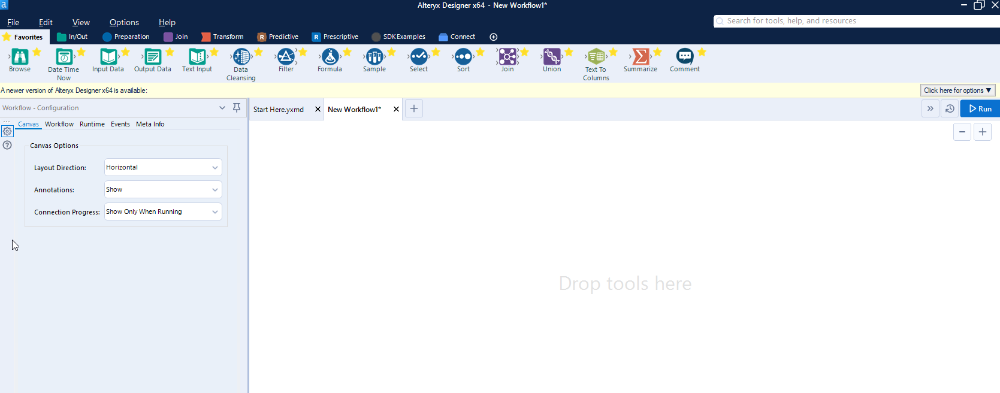
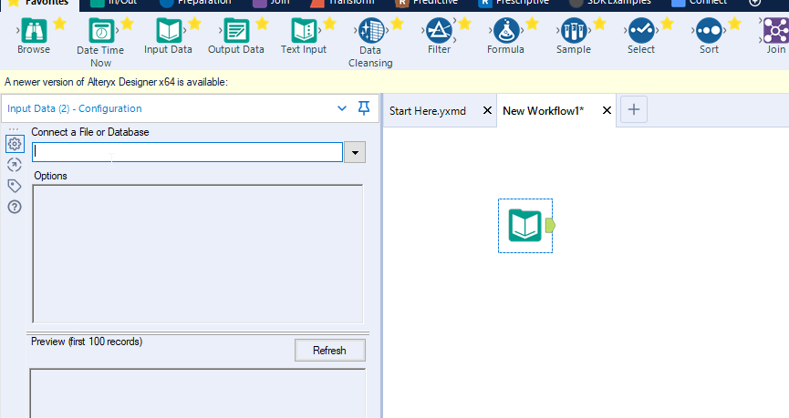
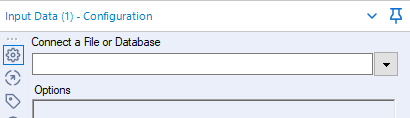
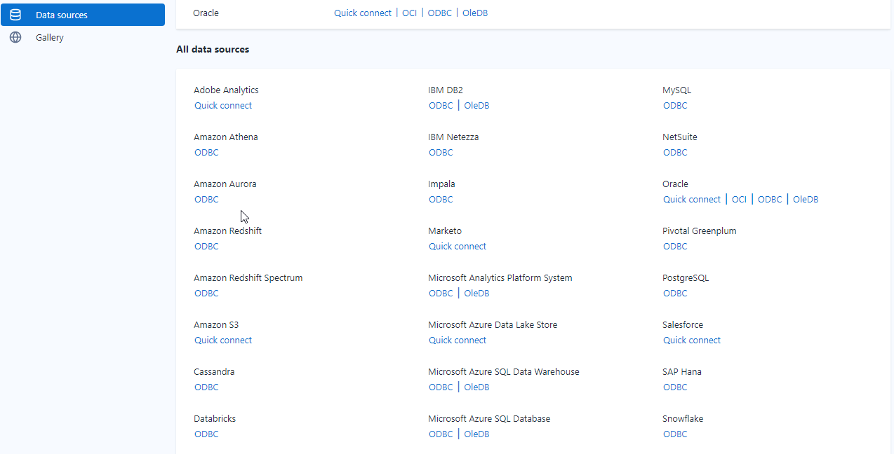
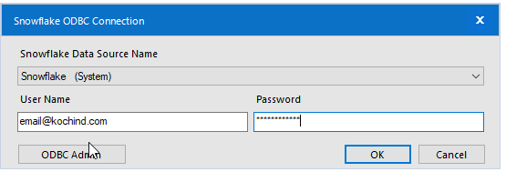

##    

### Snowflake Console Access 

1. Logon to the Snowflake UI environment of your choosing using the links below:
    - Production - https://kcsitsf1.us-east-1.snowflakecomputing.com/console  
    - Development - https://kcsitsf2.us-east-1.snowflakecomputing.com/console 

2. Upon first logon you will see a screen similar to this:

The first time you sign in you will be required to use your User Name and password rather the KochID.
- User Name = Email address
- Password = Default password (**Ch@ng3me1**) Must be changed after logging on for the first time. 

3. After logging in and changing your password you will see a screen similar to this:

#### Breakdown

**Top:**
At the top of the screen you will see serveral icons:

-   **Database** = Shows list view of databases you have permission to see.
-   **Shares** = Provides access to Snowflake Data Sharing (No access by default)
-   **Data Marketplace** = Not in use
-   **Warehouses** = Shows list view of warehouses you have permission to see. This will be used to run queries. 
-   **Worksheets** = Location used to run queries on the data. 
-   **History** = Provides list of queries run in the Snowflake console. 

You will notice your name along with the role you are signed in with in the upper left corner of the screen. If you have multiple roles assigned, you can change roles here. 

**Main:**
The center of the screen when connected to the Worksheet tab is where you will write and execute queries. The panel below the main section will display the results. You will need to set the context of the Role, Warehouse, Database and Schema before you will be able to query data. 

***Default Settings***

**Database Objects**

- To the left you will notice a search bar with a list of databases directly below. The ***KCS_DATALAKE*** database is where the files from the Data Lake UI are loaded. Clicking on the ***database*** name will expand the view and list the ***schemas*** associated with the database. Clicking on the ***schema** will expand the remaining objects. 

## Alteryx

1. Open the Alteryx application 

2. From the Top menu, drag and drop the "Input Data" icon to the canvas area to bring up the Input Data Configuration Menu

Click on the drop-down menu of the Connect a File or Database to select the data connection:

3. This action will open a new window. Select "Data Sources" from the list to expose a list of all available data sources. Search for and select   **Snowflake ODBC:***

4. Enter User Name and Password in the Snowflake ODBC Connection Window
    - User Name: Email Address
    - Password: Snowflake Password  (Not the default provided)

:::caution
You must first logon using the Snowflake console to change from the default password
:::

### Test Alteryx Connection to Snowflake

## Tableau
