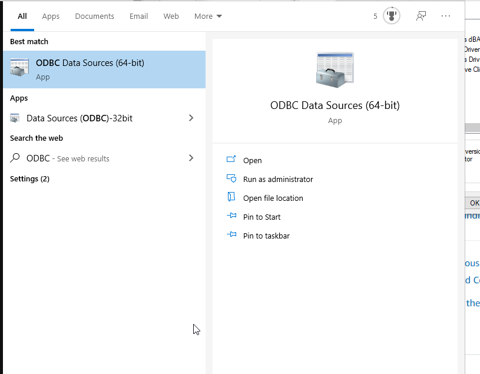

There are mulitiple ways to access your data once you have successfully uploaded a file. This document will cover the most common methods used by the business. 

## Creating ODBC Connection

:::important
You must request the Snowflake Driver to complete this step.
:::

Follow the link to request the [Snowflake Driver]('https://kochprod.service-now.com/compass?id=sc_cat_item&sys_id=5e31dacadb061010428baa82ca9619b9')

1. Search for ODBC on your local machine (64-bit version)

2. Under the User DNS tab, click the Add button to create a new data source

3. Select the Snowflake Driver that was installed with the Compass ticket request. Click Finish.

4. After clicking Finish, you will be presented with the Snowflake Configuration Dialog box that will need to be updated. The values will depend on the instance you want to connect to.

- Data Source: Name you choose to identify Driver           
- User: Email address
- Password: Snowflake Password
- Server: The Snowflake instance (Without https://) 
    - Dev: kcsitsf2.us-east-1.snowflakecomputing.com
    - Prod: kcsitsf1.us-east-1.snowflakecomputing.com
- Database: KCS_DATALAKE
- Schema: Datalake
- Warehouse: KCS_QUERY_WH (Default)
- Role:

5. After configuring Snowflake and pressing OK, you will see the connection added to the ODBC Data Source

## Snowflake

## Alteryx

## Tableau
