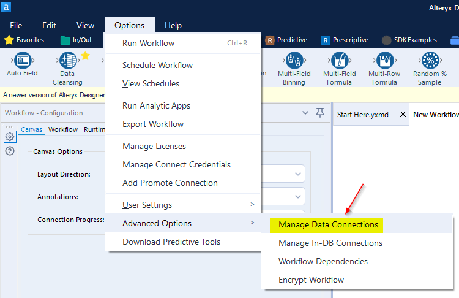
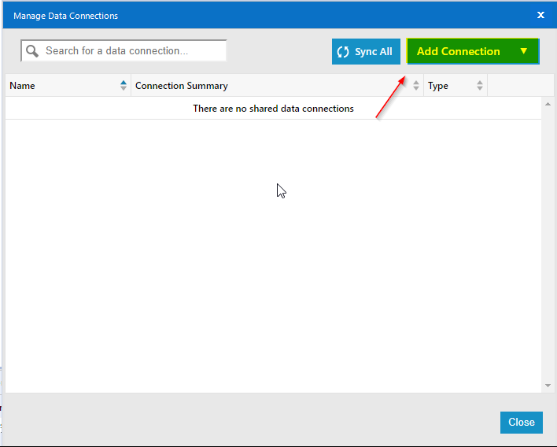
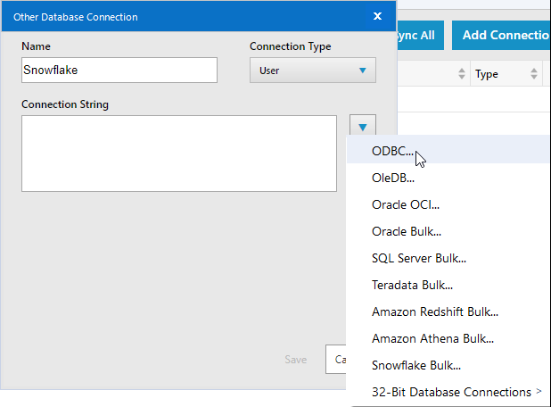
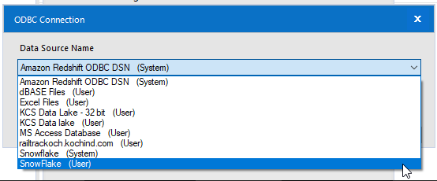
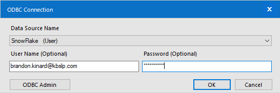
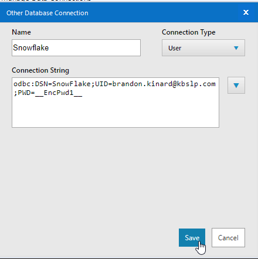
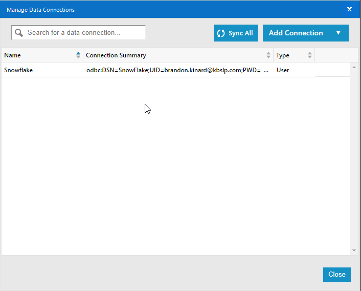

There are mulitiple ways to access your data once you have successfully uploaded a file. This document will cover the most common methods used by the business and how to set them up.

## Creating ODBC Connection

:::important
You must request the Snowflake Driver to complete these steps.
:::

Follow the link to request the [Snowflake Driver.](https://kochprod.service-now.com/compass?id=sc_cat_item&sys_id=5e31dacadb061010428baa82ca9619b9)

:::tip
Pressing CTRL then clicking link will open link in new window.
:::

For instructions on how to complete the form visit [HERE - Snowflake Driver Request Steps](drivers.md)

1. Search for ODBC on your local machine (64-bit version)

2. Under the User DNS tab, click the Add button to create a new data source

3. Select the Snowflake Driver that was installed with the Compass ticket request. Click Finish.

4. After clicking Finish, you will be presented with the Snowflake Configuration Dialog box that will need to be updated. The values will depend on the instance you want to connect to.

- Data Source: Name you choose to identify Driver           
- User: Email address
- Password: Snowflake Password
- Server: The Snowflake instance (Without https://) 
    - Dev: kcsitsf2.us-east-1.snowflakecomputing.com
    - Prod: kcsitsf1.us-east-1.snowflakecomputing.com
- Database: KCS_DATALAKE
- Schema: Datalake
- Warehouse: KCS_QUERY_WH (Default)
- Role:

5. After configuring Snowflake and pressing OK, you will see the connection added to the ODBC Data Source

## Setting Up Alteryx

1. Get started by logging into Alteryx

2. At the top of the screen select Options > Advanced Options > Manage Data Connections:

3. Click on the "Add Connection" Dropdown:

4. Select **"Other"** from the list:

5. From the list of connections, select **"ODBC"**:

6. The Snowflake(User) driver you installed should show up in this list. Select it:

7. Enter your email address for the User Name then press OK. There is no need to enter a the password on this screen.

8. Click on the Save button to save changes:

9. Verify the data connection was created with the type: User

