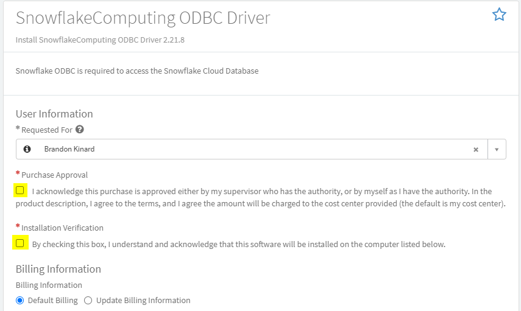

<h1>Getting Started</h1>

In order to view your data outside for the Data Lake UI, you will first need to install and configure the driver for the program you plan on using. A few of the common drivers are outlined below along with information on how to configure/request them. 

##Snowflake##

The first step in the process is to request the driver to be installed on your computer. A Compass form has been created to automate this process and can be accessed [HERE]('https://kochprod.service-now.com/compass?id=sc_cat_item&sys_id=5e31dacadb061010428baa82ca9619b9')

###Filling out the Form###

You will see a screen similar to the image below. You will need to check the 2 boxes under the Purchase Approval section to be allowed to select your computer name. 

 

