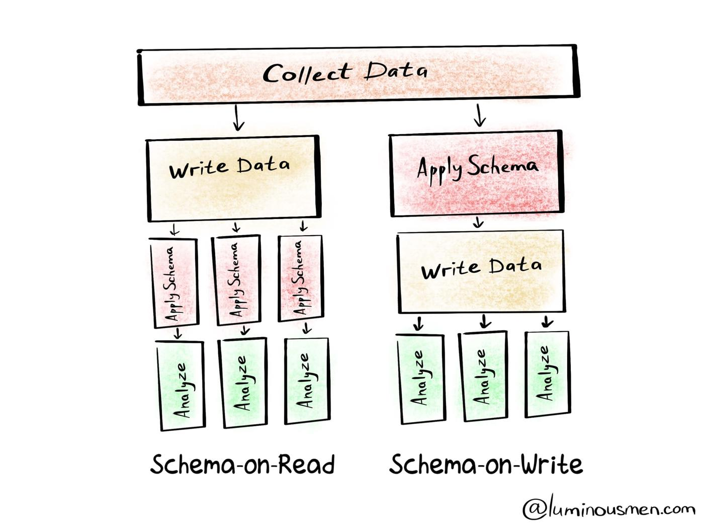

You can write JSX and use React components within your Markdown thanks to [MDX](https://mdxjs.com/).

### Schema-on-Read vs. Schema-on-Write:

In traditional databases, the table’s schema is imposed during the data load time, if the data being loaded does not conform to the schema then the data load is rejected, this process is know as Schema-on-Write. Here the data is being checked against the schema when written into the database (during data load).

***Schema-on-Write:***

Schema-on-Write helps in faster performance of the query, as the data is already loaded in a particular format and it is easy to locate the column index or compress the data. However, it takes longer time to load data into the database.

***Schema-on-Read:***

Schema-on-Read helps in very fast initial data load, since the data does not have to follow any internal schema(internal database format) to read or parse or serialize, as it is just a copy/move of a file.
This type of movement of data is more flexible incase of huge data or having two schemas for same underlying data.

#### Benefits

Schema-on-Read:
Schema-on-Read helps in very fast initial data load, since the data does not have to follow any internal schema (internal database format) to read or parse or serialize, as it is just a copy/move of a file.
This type of movement of data is more flexible incase of huge data or having two schemas for same underlying data.

So, in scenarios of large data load or where the schema is not known at load time and there are no indexes to apply, as the query is not formulated, Schema-on-Read is more efficient than Schema-on-write.

